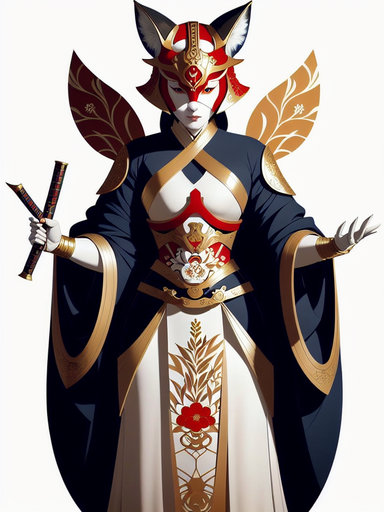
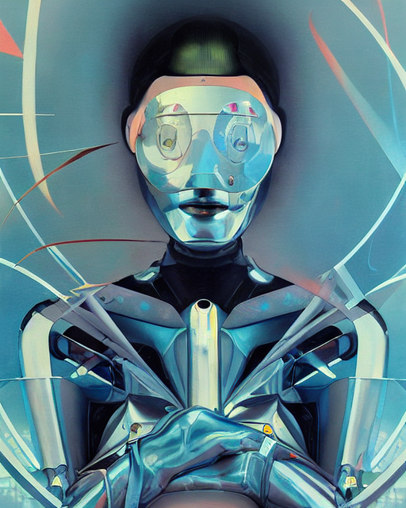
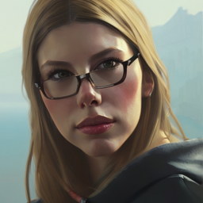
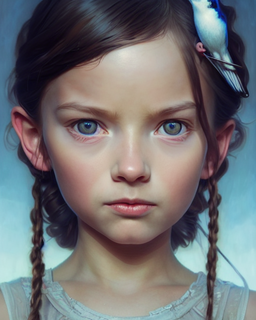

# Image Captioning with BLIP

Image Captioning is an `img2txt` model that leverages the BLIP architecture to generate descriptive captions for images. This tool automatically exports captions, making it easy to annotate visual content.

## Checkpoints

To run the model, ensure you have the necessary checkpoints. If the `checkpoints` folder does not exist, the script will automatically create it and download the model file. Alternatively, you can manually download the fine-tuned checkpoint and place it in the `checkpoints` folder.

**Download Link for BLIP-Large**: [BLIP-Large Checkpoint](<https://storage.googleapis.com/sfr-vision-language-research/BLIP/models/model_large_caption.pth>)

## Usage

You can generate captions using the command line interface (CLI) with the following syntax:

```bash
python inference.py [-h] [-i INPUT] [-b BATCH] [-p PATHS] [-g GPU_ID]
```

### Optional Arguments:
- `-h, --help`: Show help message and exit.
- `-i INPUT, --input INPUT`: Path to the input directory (e.g., `./images`).
- `-b BATCH, --batch BATCH`: Set the batch size for processing.
- `-p PATHS, --paths PATHS`: Specify a `.txt` file containing all image paths.
- `-g GPU_ID, --gpu-id GPU_ID`: Specify the GPU device to use (default is `0`). Can be `0, 1, 2` for multi-GPU setups.

### Example Command:
```bash
python inference.py -i /path/images/folder --batch 8 --gpu 0
```
## Preditive Results

Below is a collage of six images along with their generated captions:

| Image | Caption |
|-------|---------|
|  |  |
|  | A digital painting of a man with a futuristic face. |
|  | A woman in a cat mask holding a sword. |
|  | A teacher standing in front of a classroom full of children. |
|  | A tortoise on a white background. |
|  | A glass of wine sitting on top of a table. |
|  | A painting of a little girl with a bird on her head. |
|  | A painting of a woman with glasses looking at the camera. |

<table>
  <tr>
    <td>
      
      <p>A woman in a costume holding two swords.</p>
    </td>
    <td>
      
      <p>A close-up of a yellow flower with a green background.</p>
    </td>
  </tr>
  <tr>
    <td>
      
      <p>A planter filled with lots of colorful flowers.</p>
    </td>
    <td>
      
      <p>A teacher standing in front of a classroom full of children.</p>
    </td>
  </tr>
  <tr>
    <td>
      
      <p>A tortoise on a white background.</p>
    </td>
    <td>
      
      <p>A glass of wine sitting on top of a table.</p>
    </td>
  </tr>
</table>
## Contributing

Contributions are welcome! If you have major changes in mind, please open an issue first to discuss your ideas. 

Make sure to update the tests as appropriate to reflect your changes.

## License

This project is licensed under the MIT License - see the [LICENSE](LICENSE) file for details.
